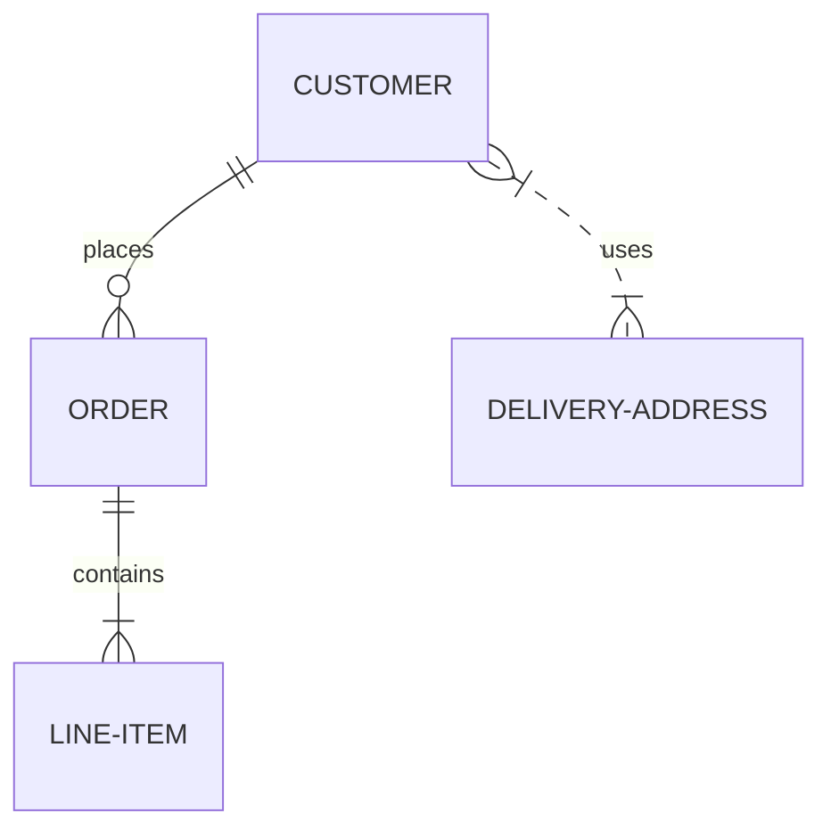
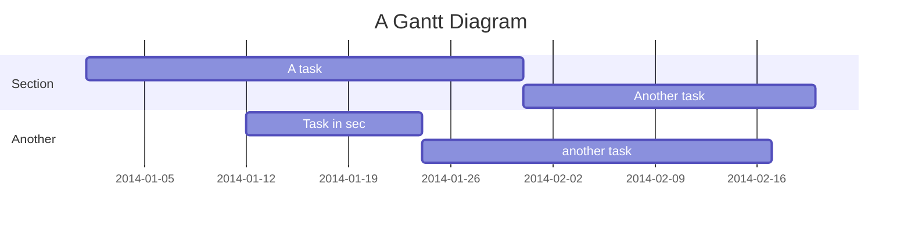

# Headline

Computer science is the study of computation, automation, and information. Computer science spans theoretical disciplines (such as algorithms, theory of computation, information theory, and automation) to practical disciplines (including the design and implementation of hardware and software). Computer science is generally considered an area of academic research and is distinct from computer programming.

## Integrations
* Generates RSS feed
* Generates ActivityPub Outbox stream
* Generates Sitemap for search engines
* Disqus comments
* Encrypt files with GPG

## Styling text

* Bold using `**` : **Bold**
* Bold using `__`: __Bold__
* Italic using `*` : *Italic*
* Italic using `_`: _italic_
* Strikethrough using `~~` : ~~Strikethrough~~
* Subscript using `<sub>` : X<sub>2</sub>
* Superscript using `<sup>`: X<sup>2</sup>
* Linking using `[text](url)`: [Emad Elsaid](https://www.emadelsaid.com)
* Shorting Long URLs: https://en.wikipedia.org/wiki/Computer_science
* Auto linking text if it's a page name: index, Features Test
* Emoji using `:EMOJICODE:` : :wrench:
* Detect date `DD-MM-YYYY` : 1-January-2023
* Detect hashtag using `#`: #Testing
* Foot note Using `[^1]` [^1]
* Typography replacement: `'` 'hello', `"` "hello", `--` --, `...` ..., `<<` <<, `>>` >>
* Inline [MathJax](https://www.mathjax.org/) with `$` :  $ax^2 + bx + c = 0$
* Inline [MathJax](https://www.mathjax.org/) with `$$` :  $$ax^2 + bx + c = 0$$


# Blocks

## Quote using `>`
> Computer science is the study of computation, automation, and information.

## Code using "```"
```
fmt.Println("hello world")
```

## Code using "\`\`\`" and language name "\`\`\`go"
```go
fmt.Println("Hello World")
```

## [MathJax](https://www.mathjax.org/) Block with `$$`

$$
\vec{\nabla} \times \vec{F} =
            \left( \frac{\partial F_z}{\partial y} - \frac{\partial F_y}{\partial z} \right) \mathbf{i}
          + \left( \frac{\partial F_x}{\partial z} - \frac{\partial F_z}{\partial x} \right) \mathbf{j}
          + \left( \frac{\partial F_y}{\partial x} - \frac{\partial F_x}{\partial y} \right) \mathbf{k}
$$

## Image using ``:


## Auto-convert image URL to an image

https://xlog.emadelsaid.com/public/logo.png

## Preview URL if in a line

https://www.emadelsaid.com/Why%20I%20became%20a%20software%20developer/


# Unordered Lists

- With `-`
+ With `+`
* With `*`

# Ordered Lists

1. With `1.`
1. With `1.` again

# Task Lists

- [ ] a todo item with `- [ ]`
- [x] a done item with `- [x]`
- [ ] Mentioning a page shows the number of todos: Features Test

# Images in one paragraph rendered in columns


# Shortcode

In a single line with `/SHORTCODE`:

/alert This is an `alert`

/info This is an `info`

/success This is a `success`

/warning This is a `warning`

[Mermaid](https://mermaid.js.org/) Graphs:




Embed another page, header-particles in this case
/embed header-particles

# Tables

| Heading1 | Heading2 |
|-----------|------------|
| Value 1.1   | Value 1.2   |
| Value 2.1  | Value 2.2   |
| Value 3.1  | Value 3.2   |

# Horizontal Rule

Using `---`

---

# Links preview

Tweet link

https://twitter.com/emad__elsaid/status/1606071605695651840

Youtube link

https://www.youtube.com/watch?v=VO7Qq-Ri9KI

Facebook link

https://www.facebook.com/emad.elsaid.hamed/posts/pfbid02oopXrWY5bHjpmRMYrWNxJZLtcF6aBu5BMm3hgUifxSmmHpWpqR81CsSmRydyFu2Al

Giphy link

https://giphy.com/gifs/star-trek-tng-the-next-generation-bKnEnd65zqxfq


[^1]: More details about a sentence or a reference citation using `[^1]: `
