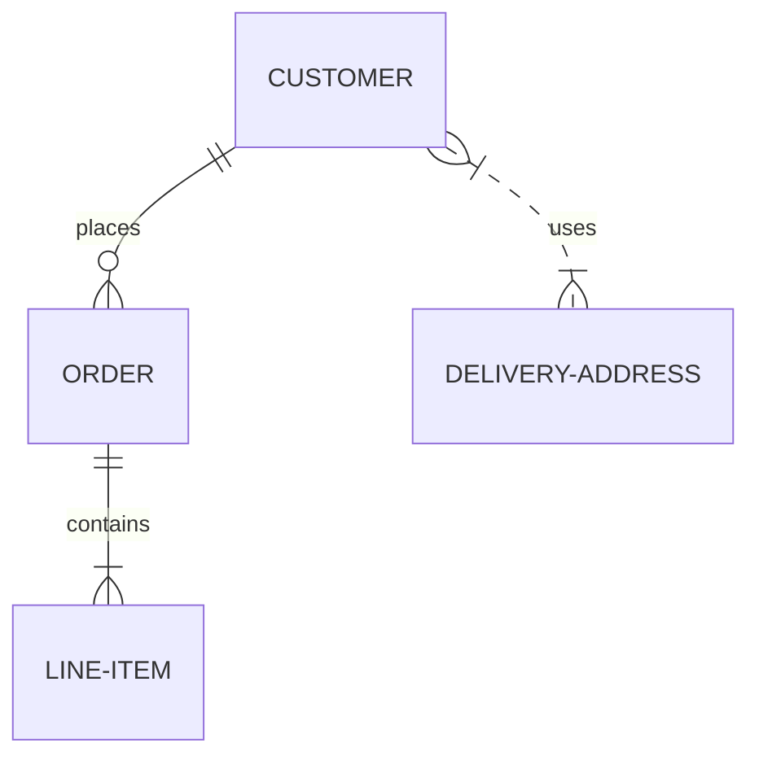
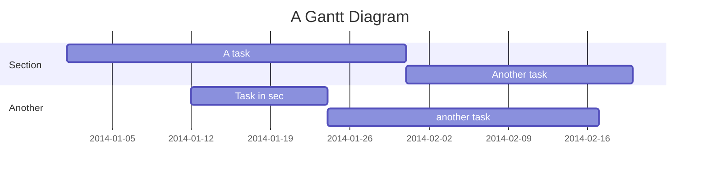

# Headline

Computer science is the study of computation, automation, and information. Computer science spans theoretical disciplines (such as algorithms, theory of computation, information theory, and automation) to practical disciplines (including the design and implementation of hardware and software). Computer science is generally considered an area of academic research and is distinct from computer programming.

# Integrations
* Generates RSS feed
* Generates ActivityPub Outbox stream
* Generates Sitemap for search engines
* Disqus comments
* Encrypt files with GPG

# Custom theme
To override any xlog template :
* Create a `theme` directory inside your knowledge base directory
* Create a file with the same name of the template you need to override with the new template
* Running xlog will load all template files then read `theme` to override any previously defined theme

For example, xlog has templates defined inside `templates/` one of them is `pages.html` which display a list of pages. to override it you can: 
* Create file `theme/pages.html` with the new Go template content.

# Banner Image
* If the page starts with an image it'll be used as a banner

# Front matter
* If the page starts with a frontmatter YAML object it'll be added to the page properties
* `title` attribute will replace the page title (that is the filename by default)

# Styling text

| Style                                           | code                         | example                                        |
|-------------------------------------------------|------------------------------|------------------------------------------------|
| Bold                                            | `**`                         | **Bold**                                       |
| Bold                                            | `__`                         | __Bold__                                       |
| Italic                                          | `*`                          | *Italic*                                       |
| Italic                                          | `_`                          | _italic_                                       |
| Strikethrough                                   | `~~`                         | ~~Strikethrough~~                              |
| Subscript                                       | `<sub>`                      | X<sub>2</sub>                                  |
| Superscript                                     | `<sup>`                      | X<sup>2</sup>                                  |
| Linking                                         | `[text](url)`                | [Emad Elsaid](https://www.emadelsaid.com)      |
| Shorting Long URLs:                             |                              | https://en.wikipedia.org/wiki/Computer_science |
| Auto linking text if it's a page name           |                              | index, Features Test                           |
| Emoji                                           | `:EMOJICODE:`                | :wrench:                                       |
| Detect date                                     | `DD-MM-YYYY`                 | 1-January-2023                                 |
| Detect hashtag                                  | `#`                          | #Testing                                       |
| Foot note                                       | `[^1]`                       | [^1]                                           |
| Typography replacement                          | `'` `"` `--` `...` `<<` `>>` | 'hello', "hello",  --,  ..., <<, >>            |
| Inline [MathJax](https://www.mathjax.org/) with | `$`                          | $ax^2 + bx + c = 0$                            |
| Inline [MathJax](https://www.mathjax.org/) with | `$$`                         | $$ax^2 + bx + c = 0$$                          |

# Date
* Dates are recognized in your markdown without extra syntax. for example `1-January-2023` shows as a link 1-January-2023
* Dates become links to a page that lists all pages with this date. For example the date in the previous line links to a page that has a list of all pages mentioning 1st of Jan 2023.
* The navigation bar has a link to "Calendar" which shows all months that include pages with dates.

So you can create a page every day like a diary or agenda, write the date in it and it'll show up in the calendar.
Also you can use a date as due date for a todo, and you can check the calendar for upcoming due dates.


# Blocks

## Quote using `>`
> Computer science is the study of computation, automation, and information.

## Code using "```"
```
fmt.Println("hello world")
```

## Code using "\`\`\`" and language name "\`\`\`go"
```go
fmt.Println("Hello World")
```

## [MathJax](https://www.mathjax.org/) Block with `$$`

$$
\vec{\nabla} \times \vec{F} =
            \left( \frac{\partial F_z}{\partial y} - \frac{\partial F_y}{\partial z} \right) \mathbf{i}
          + \left( \frac{\partial F_x}{\partial z} - \frac{\partial F_z}{\partial x} \right) \mathbf{j}
          + \left( \frac{\partial F_y}{\partial x} - \frac{\partial F_x}{\partial y} \right) \mathbf{k}
$$

## Image using ``:


## Auto-convert image URL to an image

https://xlog.emadelsaid.com/public/logo.png

## Preview URL if in a line

https://www.emadelsaid.com/Why%20I%20became%20a%20software%20developer/

## Custom blocks 
* xlog `extensions/blocks/templates` has a set of blocks 
* file names represent the block name, and the file content is a Go template that will be executed with the block content parsed as YAML 

For example `extensions/blocks/templates/book.html` represents a blocks `book` 
<pre>
```book
title: The food of the gods
author: H. G. Wells
image: /docs/public/d32ac848ea161f9b384ed2ed81d657e3f150bcd3aa355a75741b95c76b873898.avif
```
</pre>

Parses the content as YAML and is passed to the `book.html` file rendering the block to : 

```book
title: The food of the gods
author: H. G. Wells
image: /docs/public/d32ac848ea161f9b384ed2ed81d657e3f150bcd3aa355a75741b95c76b873898.avif
```

Authors:

```person
name: Emad Elsaid
image: https://www.emadelsaid.com/public/logo.png
website: https://www.emadelsaid.com
byline: Developer, Youtuber and casual gamer
```
```person
name: Emad Elsaid
image: https://www.emadelsaid.com/public/logo.png
website: https://www.emadelsaid.com
byline: Developer, Youtuber and casual gamer
```
```person
name: Emad Elsaid
image: https://www.emadelsaid.com/public/logo.png
website: https://www.emadelsaid.com
byline: Developer, Youtuber and casual gamer
```
```person
name: Emad Elsaid
image: https://www.emadelsaid.com/public/logo.png
website: https://www.emadelsaid.com
byline: Developer, Youtuber and casual gamer
```
```person
name: Emad Elsaid
image: https://www.emadelsaid.com/public/logo.png
website: https://www.emadelsaid.com
byline: Developer, Youtuber and casual gamer
```
```person
name: Emad Elsaid
image: https://www.emadelsaid.com/public/logo.png
website: https://www.emadelsaid.com
byline: Developer, Youtuber and casual gamer
```


The previous list each one of them is a block that looks like the following: 
<pre>
```person
name: Emad Elsaid
image: https://www.emadelsaid.com/public/logo.png
website: https://www.emadelsaid.com
byline: Developer, Youtuber and casual gamer
```
</pre>

Or a Github user. which requires just the name 
<pre>
```github-user
name: emad-elsaid
```
</pre>

or one-liner. as only one line is needed
```
/github-user name: emad-elsaid
```

/github-user name: emad-elsaid

/github-user name: emad-elsaid

/github-user name: emad-elsaid

# Unordered Lists

- With `-`
+ With `+`
* With `*`

# Ordered Lists

1. With `1.`
1. With `1.` again

# Task Lists

- [ ] a todo item with `- [ ]`
- [x] a done item with `- [x]`
- [ ] Mentioning a page shows the number of todos: Features Test

# Images in one paragraph rendered in columns


# Shortcode

In a single line with `/SHORTCODE`:

/alert This is an `alert`

/info This is an `info`

/success This is a `success`

/warning This is a `warning`

[Mermaid](https://mermaid.js.org/) Graphs:




Embed another page, header-particles in this case
/embed header-particles

# Tables

| Heading1 | Heading2 |
|-----------|------------|
| Value 1.1   | Value 1.2   |
| Value 2.1  | Value 2.2   |
| Value 3.1  | Value 3.2   |

# Horizontal Rule

Using `---`

---

# Links preview

Tweet link

https://twitter.com/emad__elsaid/status/1606071605695651840

X link

https://x.com/emad__elsaid/status/1606071605695651840

Youtube link

https://www.youtube.com/watch?v=VO7Qq-Ri9KI

Facebook link

https://www.facebook.com/emad.elsaid.hamed/posts/pfbid02oopXrWY5bHjpmRMYrWNxJZLtcF6aBu5BMm3hgUifxSmmHpWpqR81CsSmRydyFu2Al

Giphy link

https://giphy.com/gifs/star-trek-tng-the-next-generation-bKnEnd65zqxfq


[^1]: More details about a sentence or a reference citation using `[^1]: `
